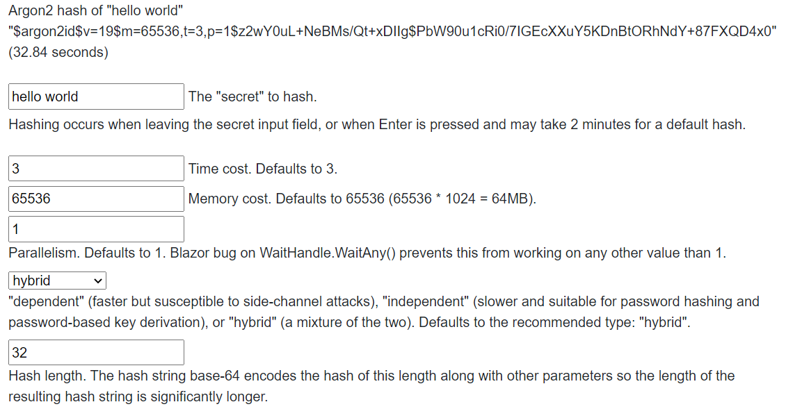

# Argon2 with Blazor WebAssembly

You can use this library to calculate Argon2 hashes in the web browser.
With the 3.1 dotnet SDK, the Blazor WebAssembly runs _a lot slower_ than
on the host - taking on the order of 20-40 seconds for a default
hash on common hardware (this is the speed after publishing, it can take
1-2 minutes when debugging). This should improve as both dotnet improves
and WebAssembly improves.

Even with the poor hashing performance in the browser, there may be use cases
that require the server to never see the secret so performing a hash with
reduced protection on the browser will be more secure than the alternative.

With Blazor, you typically assemble your pages with components. The following
is a simple example demonstrating Argon2 in the browser.

## Example

While you can call on Argon2 hashing and verifying directly from the razor
code, this example tries to be a little more friendly in that it tells you
when it is calculating the hash and disables the controls when it is doing
so.

It builds a component that looks like this:

> 

To do the "a little more friendly" bits, it uses a helper class, `Argoner`.

### Argoner Helper Class

The important part of this class is the `SetSecret()` method towards the bottom
that takes the new secret and a `Action` that can be called to notify the code
when to update the web page with new information.

[!code-csharp[Argoner](../../TestBlazor/Client/Argoner.cs?highlight=75-82)]

### HashComponent.razor

This is the component that uses the `Argoner` class above to render the hash.

The only tricky bit is near the top where, to set the new text to hash, the
method, `SetSecret()` gets called with the `this.StateHasChanged` method as a
parameter so the hasher can notify the page when the hash has started and when
it has finished.

Create a component, **`HashComponent.razor`**:
[!code-html[HashComponent.razor](../../TestBlazor/Client/Components/HashComponent.razor?highlight=19)]

### Use HashComponent.razor

To use the hash component, just include it in a page, for example you can just
put it on the website root:

[!code-html[HashComponent.razor](../../TestBlazor/Client/Pages/Index.razor)]

## Example Source

The source for this example can be found at:

(github)[TestBlazor.Client](https://github.com/mheyman/Isopoh.Cryptography.Argon2/blob/master/TestBlazor/Client)